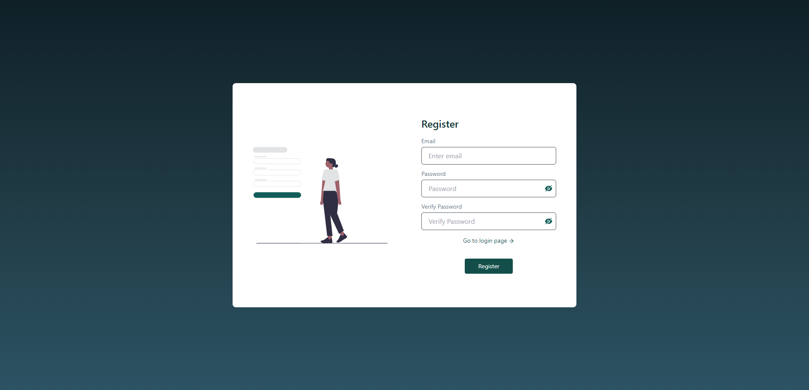
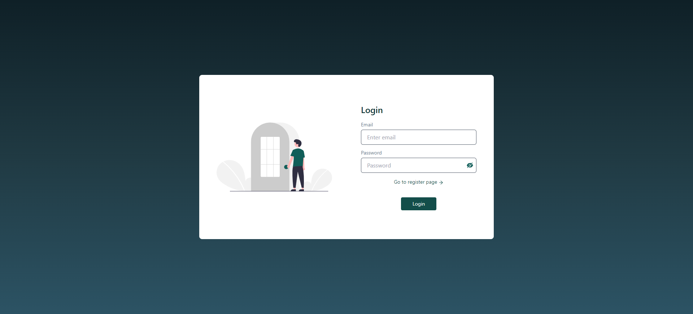

# Full-Stack-JWT-Example
JWT token kullanımını öğrenmek için geliştirdiğim basit bir Full Stack Note tutma uygulaması.<br>
Bu uygulamada Node.js ile geliştirdiğim basit bir REST API aracılığı ile Frontend tarafında kullanıcı girişi ve kullanıcı doğrulaması yaptım.<br>

## Çalıştırmak İçin
Kurulum yapacağınız cihazda mutlaka Node.js kurulu olmalıdır.
> Veriler herhangi bir veritabanına kayıt edilmemektedir. Veriler JSON formatındaki bir dosyada tutulmaktadır.
```
git clone https://github.com/ogzcode/Full-Stack-JWT-Example.git

cd ./JWT-Frontend
npm install
npm run dev

cd ./JWT-REST-API
npm install
npm start
```

## Kullandığım Teknolojiler
> Backend
* Node.js
* expess
* jsonwebtoken

> Frontend
* React
* Vite
* Tailwind
* universal-cookie
* React Router

### Öğrendiklerim
* Arka uçtan alınan token in cookie olarak saklanması
* Context API aracılığı ile global kullanıcı yönetimi
* react-router ile kullanıcı yönlendirme 
* Node.js ile jwt token oluşturma ve bunun REST API ile kullanılması
* Korumalı rotalar oluşturma
* cookie ekleme ve silme
* REST API ve client taraflarında CRUD işlemleri gerçekleştirme
* Giriş yapan kullanıcıların not oluşturup silebilmesi
* Form controlleri ve hata mesajı yayınlama

### Ekran Görüntüleri
<br>

#### Register Page
<br>
#### Login Page
<br>
#### Home Page

